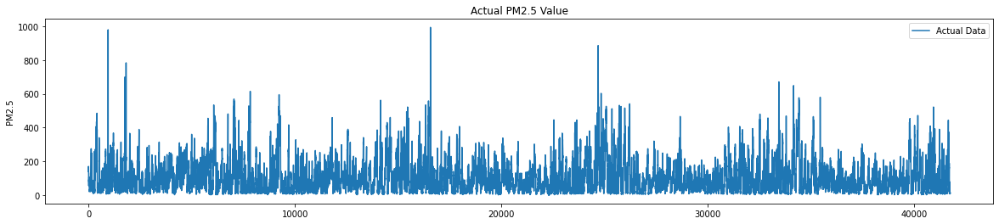
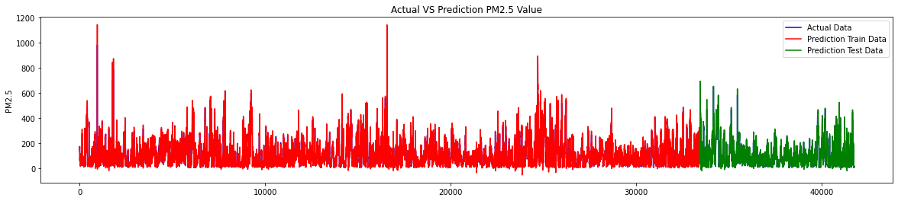

# Time Series Project - Forecasting PM2.5 Value
## Time Series Project for prediction Forecasting PM2.5 Value
**Project Criteria**
* The dataset to be used is free, but has a minimum of 1000 samples.
* Must use LSTM in model architecture.
* Validation set is 20% of the total dataset.
* The model must use a sequential model.
* Must use Learning Rate on Optimizer.
* MAE < 10% data scale.

## About Dataset
**[Forecasting PM2.5 Value](https://archive.ics.uci.edu/ml/datasets/Beijing+PM2.5+Data)**, PM2.5 is an air pollutant that is a concern for people's health when levels in air are high. This hourly data set contains the PM2.5 data of US Embassy in Beijing. Meanwhile, meteorological data from Beijing Capital International Airport are also included.

## Model Actual vs Prediction Value of PM2.5 Data



## Libraries used (python)
```
TensorFlow
Matplotlib
Keras
SKLearn
Numpy
Pandas
``` 
